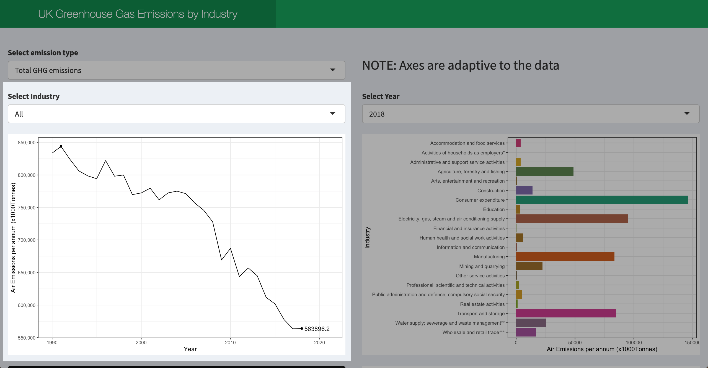

# Interactive Dashboard: UK Emissions by Industry

## Introduction

This repository contains an interactive dashboard which allows users to explore
the greenhouses gases emitted in the UK. The source of the data is:
[ONS 1990 - 2018 UK emissions](https://www.ons.gov.uk/economy/environmentalaccounts/datasets/ukenvironmentalaccountsatmosphericemissionsgreenhousegasemissionsbyeconomicsectorandgasunitedkingdom). The interactive dashboard is live and hosted at:
[shinyapps.io](https://dc27.shinyapps.io/uk_emissions_app/).

## Project and Aims

Data regarding the greenhouse gas emissions of various UK industries was made
public by the [Office for National Statistics](https://www.ons.gov.uk/). The
aim of this project was to examine the dataset and create an interactive
dashboard to display:

+ the trend over time for a given emission type (GHG) and industry
+ a breakdown of industries for a given year

## Cleaning Process

For each GHG

1. The data is read from the [atmoshpericemissionsghg.xls](data/raw_data/atmoshpericemissionsghg.xls) spreadsheet,
which contains separate sheets relating to each GHG and a totals page.
2. The data is passed through a function that converts it to a tidier form by:
    - renaming columns to appropriate names
    - taking a subset of only the desired data
    - pivoting the data to long form
3. The clean and tidy data is written to a csv in the [clean data directory](data/clean_data)

A new file was made to contain the total emissions across all industries for
each GHG. These values were included in the raw data. Each GHG and the total of
all GHGs is extracted from the raw data, cleaned and tidied as above, and then
combined into one dataset containing all of the totals.

## How to Run the Project

The dashboard is live and can be explored at 
[shinyapps.io](https://dc27.shinyapps.io/uk_emissions_app/)
.

To run the project locally:

1. clone this repository
2. open the R project file: [uk_emissions_dashboard.Rproj](uk_emissions_dashboard.Rproj)
in RStudio.
3. Open either
    - [ui.R](ui.R)
    - [server.R](server.R)
    - [global.R](global.R)
4. Click "Run App" or enter the command:

```
shiny::runApp()
```

## Exploring the dashboard

The initial view of the dashboard:


There is additional information at the bottom of the dashboard. The decision was
made to keep all of the information on one tab for ease of use.


At the top of the dashboard:

The user can select a particular greenhouse gas and the plots will update
automatically:


On the left-hand side:

The user can select a particular industry and then the plot showing the
emissions over time would be displayed.



On the right-hand side:

The user can also enter a year and then a plot showing a breakdown of all the
industries and the emissions for each industry.


## Packages Used

The cleaning script and dashboard elements were written in R using RStudio,
making use of the following packages.

| Library | Version |
| --------|---------|
|tidyverse|1.3.0|
|assertthat|0.2.1|
|assertr|2.7|
|shiny|1.5.0|
|shinydashboard|0.7.1|
|RColorBrewer|1.1.2